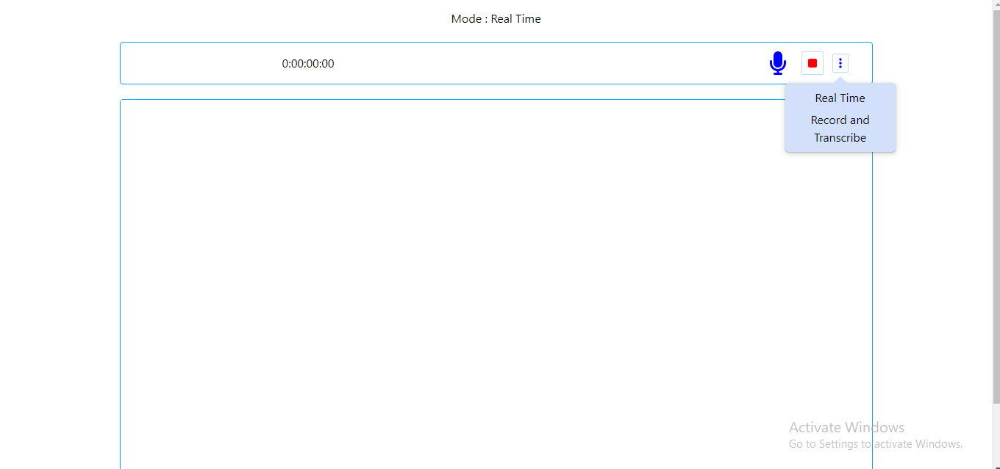
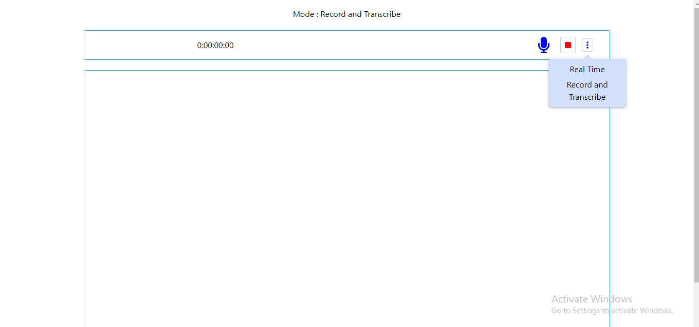

<h1 align="center">Textlo</h1>
<br />

> Finding it had to prepare notes we got you covered just speak out your thoughts then we will do the rest

<br />
<a href="">
    
</a>

## Introduction

Textlo is a web application that enables users to transcribe spoken language in real-time or from recorded audio, currently it only supports English Language.

## Table of Content

- [Getting Started](#getting-started)
  - [Local Setup](#local-setup)
- [Technologies](#technologies)
- [Features](#features)
  - [Realtime Transcription](#realtime-transription)
  - [Record and Transcribe](#record-and-transcribe)
- [Future](#future)
- [Resources](#resources)
- [Authors](#authors)
  - [Manasseh Hirekaan](#manasseh-hirekaan)

## Getting Started

Currently the web app is hosted live on : https://textlo.netlify.app/

### Local Setup

- Pre-Requisite
  - node

1. Clone the repository

```shell
git clone https://github.com/jackfros-glitch/Textlo.git
```

2. Install the packages

```shell
npm install
```

3. Run the application in development

```shell
npm run dev
```

## Technologies

- [Typescript](https://www.typescriptlang.org/) - The frontend Programming Language
- [React.ts](https://react.dev/) - Javascript frontend library
- [TailwindCss](https://tailwindcss.com/) - Css framework
- [axios](https://axios-http.com/docs/intro) - Promise based HTTP Client for the Browser
- [ReactJoyRide](https://docs.react-joyride.com/) - React library for creating product Tours

## Features

### Realtime Transription

- The real-time transcription feature of the web app is powered by [React's speechRecognition hook](https://www.npmjs.com/package/react-speech-recognition) which under the hood uses [webSpeechApi](https://developer.mozilla.org/en-US/docs/Web/API/SpeechRecognition) to convert speech audio into text.



### Record and Transcribe

- The web app's record and transcribe feature is powered by the [AssemblyAI Translation Engine](https://www.assemblyai.com/), which employs efficient large language models to convert audio files into text.



## Future

The web app currently transcribes speech audio in real-time and allows audio recording and transcription. Next, I'll prioritize adding a feature for users to upload MP3 files for transcription. I welcome your suggestions for additional features and improvements.

## Resources

- [webSpeechAPI](https://developer.mozilla.org/en-US/docs/Web/API/Web_Speech_API)
- [react-speech-recognition](https://www.npmjs.com/package/react-speech-recognition)
- [AssemblyAI](https://www.assemblyai.com/)

## Authors

### **Manasseh Hirekaan**

[Jackfros-glitch](https://github.com/jackfros-glitch)
Manasseh is a full stack software engineer who enjoys both backend work and frontend work.

If you would like to contact [Manasseh](mailto:hirekaanm3@gmail.com) about any opportunities, feel free to reach out!
